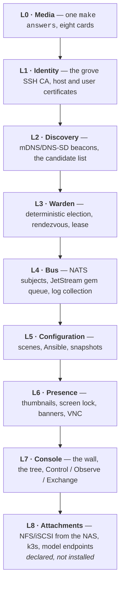
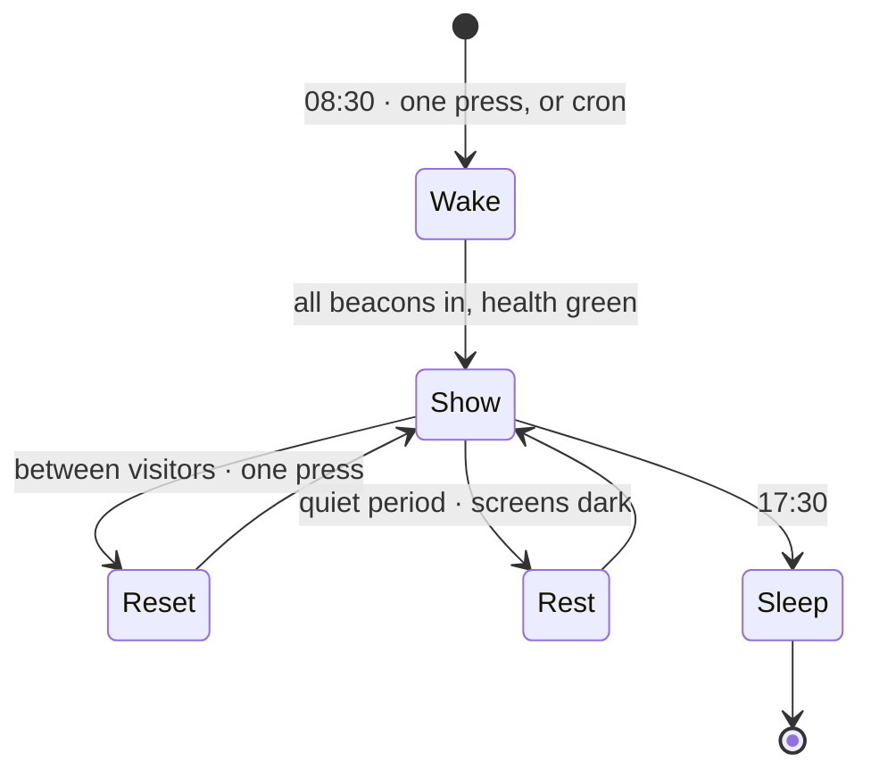
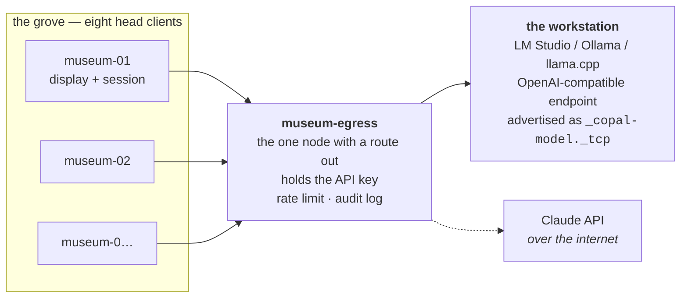

<!-- SPDX-License-Identifier: MIT -->
<!-- Copyright (c) 2026 Paul Richeson -- copal-alpine-linux -->

# Copal Grove — orchestrating a room full of Copal machines

**A plan.** Eight Raspberry Pis on one switch, one console, and a day that
starts by turning them on and ends by turning them off.

Copyright (c) 2026 Paul Richeson. MIT licensed — see `LICENSE`. Copal Linux is
an aggregation of Alpine Linux, not a derivative work of it; Alpine and its
packages remain under their own licences.

Companion document: **[`grove-lab-report.md`](grove-lab-report.md)** — the
survey of prior art, the museum-day requirement, and the console's interface
design. This file is the architecture and the build order.

---

## 0 · The one paragraph

A **grove** is a named set of Copal machines on one LAN that trust one
certificate authority. They find each other by mDNS, prove themselves by SSH
certificate, one of them elects itself **warden** to act as a rendezvous and a
log sink, and a **console** on the operator's machine drives all of them —
individually, by tag, or all at once. Work is handed out as **gems**: small
self-describing units on a durable queue, acknowledged when finished and
redelivered when not. The whole thing is layered, and every layer above the
first is optional: with nothing but SSH and a list of addresses the console
still works, and each layer above that removes typing rather than adding a
dependency.

---

## 1 · Vocabulary

Naming is not decoration here; it is what the console's labels say, what the
subjects on the bus are called, and what a person shouts across a museum
gallery. Copal is tree resin, so the fleet is what a stand of those trees is.

| Term | Means |
|---|---|
| **grove** | the fleet: machines sharing a name and a CA. `museum`, `lab-b`. |
| **node** | one machine in the grove. Has an id, a role, and tags. |
| **warden** | the node currently elected to be rendezvous, log sink and queue host. A *convenience*, never an authority — see §7. |
| **console** | the operator's program. Runs on the Mac, on a node, or on both. |
| **gem** | one unit of work. Self-describing, content-addressed, idempotent. |
| **treasure** | the accumulated results of a job — the gems that came back. |
| **scene** | a declarative state of the whole grove: what runs, what is on screen, what the console shows. The museum day is four scenes. |
| **stranger** | a machine seen on the network that is *not* in the grove. Shown, never contacted. |
| **attachment** | an optional external resource — a NAS export, an iSCSI LUN, a model endpoint — declared in the grove file, not installed into the image. |

---

## 2 · The invariants

Everything below is negotiable. These are not. They are listed first because
each layer that follows has to be checked against them, and because "self
organizing on a local network" is a sentence that has to be made safe on
purpose — it does not become safe by accident.

1. **Discovery announces. It never authorizes.** mDNS has no authentication of
   any kind — anyone on the segment can answer any query and advertise any
   service. So discovery produces *candidates*, and a candidate becomes a node
   only when its SSH host certificate validates against the grove CA.
2. **No private key crosses the network, ever.** Node keys are generated on the
   node. Only public keys go out, and only certificates come back.
3. **Credentials are derived and short-lived.** Host certificates 90 days, user
   certificates 8 hours, both signed by the grove CA and both re-issued
   automatically. Short lifetimes are what make revocation a rarity rather than
   a fire drill.
4. **Automation gets a forced command, not a shell.** The `copal-grove`
   service account's authorized principal maps to one command that parses one
   verb. The human account keeps its ordinary shell; those are two jobs and the
   grove keeps them apart, exactly as stages 1 and 13 keep root and the user
   apart.
5. **A node may only speak for itself.** On the bus, publish permission is
   scoped to `grove.<name>.node.<own-id>.*`. A compromised node can lie about
   its own temperature. It cannot forge another node's telemetry, and it cannot
   issue commands.
6. **The grove is LAN-only.** Nothing in this plan opens a port to the internet,
   forwards one, or phones home. The one node that needs egress (§11) is named,
   is the only one that has it, and says so in the console.
7. **Nothing discovered is executed.** Scenes and playbooks come from a git
   checkout on the console, not from the network. A beacon can ask to be looked
   at; it cannot ask to be run.
8. **The console works with every layer removed.** If Avahi is off, addresses
   are typed. If the bus is down, commands go over SSH. If the warden is
   unplugged, the console talks to nodes directly. A layer that becomes
   load-bearing has become a bug.

---

## 3 · The layers



| Layer | Adds | Costs | With it missing |
|---|---|---|---|
| L0 Media | eight cards from one interview | nothing — it is `answers.txt` doing more work | you type the interview eight times |
| L1 Identity | no `known_hosts`, no shared passwords, no key copying | one CA to keep offline | keys per node, `known_hosts` churn, TOFU |
| L2 Discovery | the node list fills itself in | `avahi` on each node, ~3 MB | you type addresses into the grove file |
| L3 Warden | one place logs land and queues live | an election that must be boring | console holds the queue; nodes still work |
| L4 Bus | fan-out commands, durable work, live telemetry | `nats-server`, one static binary | SSH fan-out; slower, no work queue |
| L5 Config | a day is a file, not a memory | Ansible on the console, python3 on nodes | scripted `ssh` loops |
| L6 Presence | the wall of screens; lock; broadcast | VNC server per node, screenshots | you walk to the machine |
| L7 Console | one window for all of it | the program this plan is mostly about | `copal grove` on the command line |
| L8 Attachments | shared storage, containers, inference | per-site configuration | local disk, local work |

The point of the table is the right-hand column. Read it as the failure plan:
every row degrades to something a person can still operate at 9am with a
gallery filling up.

---

## 4 · Discovery

### What is advertised

Each node runs Avahi and publishes one service type:

```
_copal-grove._tcp   port 7420
```

with a TXT record:

| Key | Example | Why |
|---|---|---|
| `g` | `museum` | grove name — filters everything else out |
| `n` | `museum-03` | node id, stable, equals the hostname |
| `r` | `node` / `warden` | current role |
| `s` | `1412` | warden score (§7) |
| `a` | `aarch64` | architecture |
| `m` | `1024` | RAM, MB |
| `b` | `2026-09-04.3` | `COPAL_BUILD_ID` from `/etc/copal/build` |
| `ca` | `SHA256:9f2c…` | fingerprint of the grove CA the node trusts |
| `t` | `wall,sdr,gallery-north` | tags |
| `v` | `1` | beacon version |
| `k` | `4e1a…` | rolling HMAC, below |

`ca` is the one that matters for the operator: two machines that disagree about
their CA fingerprint are not in the same grove no matter what `g` says, and the
console shows that as a distinct state — **wrong grove** — rather than as a
connection failure ten seconds later.

### Why a HMAC in a TXT record, and what it is not for

`k` is `HMAC-SHA256(grove PSK, n || g || floor(unixtime/300))`, truncated to 8
bytes. A grove PSK is generated by `make answers` and lives on the cards.

It is a **spam filter, not a security control**, and the distinction is
load-bearing. It costs nothing, and it means the console's candidate list is
not trivially polluted by anything on the segment that fancies calling itself
`museum-03`. It does not authenticate anybody: the PSK is on eight SD cards, a
five-minute window is replayable inside that window, and a node that has the
PSK has it forever. Authentication is §5's job and only §5's job. Any code that
starts treating `k` as proof is code that has broken invariant 1.

### The candidate list has three states

```
  ✓  museum-03    10.0.0.23    node      cert ok            up 6d
  ?  museum-07    10.0.0.31    node      no cert yet        seen 2s ago
  !  epson-XY10   10.0.0.44    —         stranger           seen 2s ago
```

`?` is the enrolment path (§5). `!` is a machine on the network that is not
part of the grove — a printer, a phone, a visitor's laptop. Showing strangers
is deliberate: a museum operator who can see what appeared on the network today
is better off than one who cannot, and it costs one extra Avahi browse.

### Turning it off

`COPAL_GROVE_DISCOVERY=static` in `answers.txt` installs no Avahi and reads the
node list from the grove file. Sites that will not run mDNS get a grove that is
identical in every other respect.

---

## 5 · Identity — derived credentials

This is the layer that makes the rest defensible, and the research is
unambiguous about the shape: an SSH certificate authority, host certificates to
kill trust-on-first-use, user certificates with hours-long lifetimes, and no
shared secrets on the wire.

### The three keys

| Key | Where it lives | Ever copied? |
|---|---|---|
| grove CA private | `~/.copal/ca/<grove>_ca` on the console, mode 600 | **never** |
| grove CA public | on every card, in `/etc/ssh/copal_grove_ca.pub` | yes — it is public |
| node host key | generated on the node at first boot | never leaves |

### Enrolment, once per node

```mermaid
sequenceDiagram
    participant C as Console (holds CA)
    participant N as Node (first boot)
    N->>N: ssh-keygen host key (stays here)
    N->>C: beacon: n=museum-03, no cert, token=<one-time>
    C->>C: token matches the one written to card 03,<br/>and has not been used
    C->>N: ssh (bootstrap principal) → collect host pubkey
    C->>C: ssh-keygen -s CA -h -I museum-03 -n museum-03,10.0.0.23 -V +90d
    C->>N: install host certificate, burn the token
    N->>N: sshd HostCertificate; TrustedUserCAKeys
```

The one-time token is `COPAL_GROVE_TOKEN` — 32 hex characters, different per
card, written by `make answers`. A card that is lost enrols zero times more
than the once it was for.

### After enrolment

On the console, `~/.ssh/known_hosts` gains exactly one line for the whole
grove:

```
@cert-authority *.museum.local,10.0.0.* ssh-ed25519 AAAA… copal grove CA museum
```

That is the payoff. Eight machines, or eighty, and no `known_hosts` prompt ever
again — and, more to the point, a *changed* host key becomes an error the
console can explain instead of a warning the operator learns to press through.

On each node:

```
TrustedUserCAKeys /etc/ssh/copal_grove_ca.pub
AuthorizedPrincipalsFile /etc/ssh/principals/%u
HostCertificate /etc/ssh/ssh_host_ed25519_key-cert.pub
```

with `principals/copal-grove` containing `grove-operator` and
`principals/<user>` containing `grove-human`.

### User certificates, and the forced command

The operator runs `copal grove login`, which signs an 8-hour certificate with
both principals and adds it to the agent. Nothing else needs doing all day, and
by tomorrow it has expired on its own.

`grove-operator` is bound in `sshd_config` to a forced command:

```
Match User copal-grove
    ForceCommand /usr/bin/copal-grove-exec
    PermitTTY no
    X11Forwarding no
    AllowTcpForwarding no
```

`copal-grove-exec` reads `SSH_ORIGINAL_COMMAND`, and it accepts a *verb list*,
not a shell string: `scene apply rest`, `snapshot restore visitor`, `power off`,
`state`, `log tail`. Anything else is a refusal with an exit code and a line in
the log. This is invariant 4 made real, and it is the difference between "the
console can run commands on eight Pis" and "anything holding an 8-hour
certificate can run anything on eight Pis".

### Why not a full PKI

`step-ca` is the right answer at a hundred machines and an identity provider,
and the plan should not pretend otherwise. At eight it is a service to run, back
up and upgrade in exchange for automation of a thing that happens eight times.
`ssh-keygen -s` on the console, driven by `copal grove sign`, is the same
cryptography with none of the operations. §14 puts step-ca in the "when it
hurts" milestone with the migration path stated: the CA key is the same key, so
moving to step-ca later re-signs nothing.

---

## 6 · The bus — packetized message delivery

### What is chosen and why

**NATS with JetStream.** One static Go binary under 20 MB, runs comfortably on
a Pi, subject-based fan-out with wildcards, and JetStream supplies the two
things a plain pub/sub cannot: a durable work queue with acknowledgement and
redelivery, and last-value retention so a console that just started can render
the whole grove's state without asking anyone.

The alternatives were considered and are named honestly:

| | Verdict |
|---|---|
| **MQTT (mosquitto)** | Alpine packages it and it is smaller. Retained messages give you last-known-value, but there is no stream, no replay, and no work-queue semantics — you would build gem redelivery yourself. Kept as the fallback for sites that already run a broker; NATS speaks MQTT natively if both must coexist. |
| **ZeroMQ** | Not a broker — a socket library, and a very good one. It is exactly right *inside* a job (see the SDR gem in §10, which is ZMQ PUSH/PULL by design) and exactly wrong as the fleet control plane, because there is no discovery, no durability and no fan-out topology that survives a node rebooting. |
| **Redis / a database queue** | More memory than the whole job on a 512 MB Zero 2, and one more thing to keep alive. |
| **k3s + a Kubernetes queue** | See §11. It is a fine answer to a different question. |

### Subjects

```
grove.museum.hello                       node → all     presence, 10s
grove.museum.node.<id>.state             node → all     telemetry, last-value retained
grove.museum.node.<id>.thumb             node → all     screenshot, 1–5s, downscaled
grove.museum.log.<id>                    node → warden  log lines
grove.museum.cmd.all                     console → all  broadcast verb
grove.museum.cmd.tag.<tag>               console → some
grove.museum.cmd.node.<id>               console → one
grove.museum.ack.<id>.<corr>             node → console per-command result
grove.museum.work.<job>                  JetStream work queue — the gems
grove.museum.gem.<job>.<seq>             worker → console  results
grove.museum.event                       anything worth a toast
```

Permissions follow invariant 5: a node's credentials allow publish on
`…node.<own-id>.*`, `…log.<own-id>`, `…ack.<own-id>.*` and `…gem.>`, subscribe
on `…cmd.>` and `…work.>`, and nothing else. The console publishes `cmd.>` and
subscribes to everything. mTLS with certificates from the same grove CA, so
there is one trust root in the entire system.

### The command envelope

Commands are one line of JSON, and they carry their own idempotence:

```json
{"v":1,"corr":"a3f1…","verb":"scene","args":["apply","rest"],
 "iss":"grove-operator","exp":1789042000,"once":"2026-09-08T09:14:22Z"}
```

`corr` correlates the acknowledgement. `exp` means a command that sat in a
queue while a node was off does not fire at four in the afternoon because
somebody plugged it back in — it expires. `once` makes redelivery safe. Every
one of those fields exists because the museum case is *a machine that was
turned off when you sent the message*, and that is the normal case, not the
exception.

### Delivery guarantees, stated plainly

Presence and telemetry are best-effort and lossy on purpose. Commands are
at-least-once with an explicit ack, and the console shows unacknowledged
commands as pending rather than as done. Gems are at-least-once with
redelivery on ack timeout, which is why a gem must be idempotent and why
results are content-addressed — the same tile computed twice is the same tile.

---

## 7 · The warden

### The election

Not Raft. Eight machines on one switch do not have the partition problem Raft
exists to solve, and a consensus algorithm that nobody in the building can
debug at 9am is a liability rather than a feature. The election is deterministic
and it is a sort:

```
score = 1000 * (wired ethernet)
      +    1 * (RAM in MB)
      +    1 * (uptime in minutes, capped at 1440)
      -  500 * (running the exhibit display)
tie-break: lowest node id, string compare
```

Every node computes its own score, publishes it in the beacon TXT record, and
the highest score that is currently announcing takes the role. A node that sees
a higher score than its own yields at the next announcement — two announcement
intervals, so about twenty seconds, is the worst case for a handover.

The `-500` term is the interesting one: the machine driving the visitor-facing
display should not also be the machine hosting the queue, and encoding that as
a score term rather than as configuration means it stays true when the display
moves to a different Pi.

### Why split brain does not matter here

Because of invariant 8. Two wardens for twenty seconds means two log sinks and
two queue hosts; the console sees both, prefers the higher score, and no
command is lost because commands do not go *through* the warden — they are
published on the bus and the warden is one subscriber among many. The warden
holds a lease file so that its own restart is clean, and that is the whole of
the coordination.

If the warden is unplugged mid-day: the console notices in ten seconds, the
next-highest node takes the role, the JetStream stream is re-created empty, and
gems in flight are re-queued from the console's job manifest. Losing the warden
costs the in-flight work of one job. It does not cost the grove.

---

## 8 · Configuration — and the honest answer about Ansible

### Is there an open-source Ansible playbook for this?

There are several for the *cluster* half, and they are worth reading:

- **`geerlingguy/pi-cluster`** — Pi fleet automation, the reference for what
  inventory and networking look like on real boards.
- **`geerlingguy/k3s-ansible`**, **`boyroywax/ansible-k3s-rpi`**,
  **`imerica/pik3s`** — k3s onto a Pi cluster, three variations of the same
  shape.
- **`stevewoolley/pi-fleet`** — plain fleet management, no Kubernetes.

None of them fit unchanged, for one reason worth stating clearly: **they are
Debian playbooks.** `apt`, `systemd` units, `systemd` timers, Raspberry Pi OS
paths. Copal is Alpine — `apk`, OpenRC, `rc-service`, `crond` rather than
timers. Porting `geerlingguy/k3s-ansible` to Alpine is a real afternoon, not a
`when: ansible_os_family` line.

And there is a deeper mismatch. Those playbooks *install the operating system's
software*. Copal already has a 15-stage installer that does that job better
than a playbook can, because it does it with no network dependency and no
Python on the target. Ansible's job in the grove is not installation. It is
**the daily play**: apply a scene, gather facts, collect logs, restore a
snapshot, upgrade a package on seven machines and skip the one that is off.

So the recommendation is: Ansible, scoped to the day, not to the build.

### The shape

```
groves/
  museum/
    grove.toml            the grove file — name, CA, nodes, tags, attachments
    inventory/
      copal_grove.py      dynamic inventory: mDNS + certificate check → hosts
      static.ini          the fallback when discovery is off
    scenes/
      wake.yml  show.yml  reset.yml  rest.yml  sleep.yml
    roles/
      copal_node/         facts, packages via apk, OpenRC services
      copal_display/      the exhibit app, autologin, screen blanking
      copal_worker/       the gem runner
      copal_warden/       nats-server, the log sink
```

`copal_grove.py` is the piece that makes discovery pay for itself: it browses
`_copal-grove._tcp`, drops strangers and wrong-grove beacons, checks each
candidate's host certificate against the CA, and prints an inventory. The
operator never edits a host list.

Requirements on the node are small: `python3` (already there — stage 7), and
that is all; `apk` is driven through `community.general.apk`, services through
`ansible.builtin.service` with the OpenRC provider, and the handful of things
neither covers are `raw`.

### Push, pull, or both

Both, and for a specific reason. **Push** is the console pressing a button —
interactive, immediate, and it reports which nodes were unreachable. **Pull** is
`ansible-pull` from a git checkout, run by `crond` with a randomised delay,
and it exists to catch the machine that was switched off during the push. A Pi
that was unplugged all week comes back, pulls, and converges without anyone
remembering it existed. On Alpine that is `crond` and not a systemd timer, and
the randomised delay is `sleep $((RANDOM % 300))` at the top of the job rather
than `RandomizedDelaySec`.

Scenes are committed to git and the pull checks the signature, which is
invariant 7: the grove executes what the console's repository says, not what
the network says.

---

## 9 · Scenes — the museum day

The requirement, in the operator's words: *every morning we turn all these
Raspberry Pis on, and each day the task will be different.*

A **scene** is a named, declarative, idempotent state of the whole grove.
Applying a scene twice does nothing the second time. The day is four of them,
and "today's task is different" means one file changed, not eight machines
touched.



| Scene | What it does | What the console shows |
|---|---|---|
| **wake** | power on (§9.1), wait for beacons, health check, mount attachments, set volume and brightness, start today's job | a checklist filling in, red until every node is green |
| **show** | the exhibit runs; workers pull gems; thumbnails stream | the wall |
| **reset** | quit every user program, restore the user's home from the stage-11 snapshot, relaunch clean | a progress bar and a per-node tick |
| **rest** | displays off, workers paused, nodes stay up | dimmed wall, "resting since 14:02" |
| **sleep** | flush logs, `poweroff`, and confirm each one actually went | nodes going grey one by one, and a loud red for any that did not |

`reset` is the one that is nearly free, because Copal already has it: stage 11
installs rsync snapshots on a third partition. "Get ready for the next user" is
`copal-snapshot restore` plus a session restart, and it takes seconds rather
than the minutes a reimage would.

### 9.1 · Power — the unglamorous truth

**A Raspberry Pi cannot be woken by Wake-on-LAN from a powered-off state.**
There is no standby rail feeding the NIC. Any plan that says "WoL at 8:30" is
wrong, and the museum needs to know that before it buys anything. The real
options, in the order they should be considered:

1. **Never fully power off.** `rest` blanks displays and idles the CPUs. A Pi
   Zero 2 at idle with HDMI off is around 0.7 W; eight of them for sixteen
   overnight hours is under a tenth of a kilowatt-hour. This is almost always
   the right answer and it needs no hardware.
2. **Per-port USB power** — `uhubctl` on a switchable hub. Cutting and
   restoring port power is a real cold boot, driven from the same scene system,
   and the hub is under fifty pounds.
3. **A smart PDU or smart plugs** with a local HTTP or MQTT API. One relay per
   node, or one per shelf. Anything that requires a vendor cloud account fails
   invariant 6 and should not be bought.
4. **GPIO wake** on Pi 4 and Pi 5 — `GLOBAL_EN` / the power button header can
   restart a halted board, and Pi 5 has `POWER_OFF_ON_HALT`. Real, but it means
   a wire per board.

The console shows power capability per node, because "shut down to save power"
means something different on a node the console can turn back on than on one
that needs a human with a plug.

---

## 10 · The work — what the grove computes

Three jobs, chosen so that each demonstrates a different property, and all
three producing something a visitor can watch.

### 10.1 · `smallpt` — the picture that assembles itself

A 99-line Monte Carlo path tracer. Splits into tiles with no communication
between them at all, which makes it the cleanest possible demonstration of the
gem lifecycle.

- **A gem** is `{scene, width, height, samples, y0, y1, seed}` — a band of
  scanlines.
- **A result** is the band's pixels plus wall-clock time and the node id.
- **Idempotent** because the seed is in the gem: recomputing a band that was
  redelivered gives byte-identical output. This is what makes at-least-once
  delivery acceptable, and it is worth pointing at in the exhibit label.
- **The display** is the image filling in, tile by tile, each tile tinted at
  the edge by which node produced it. Eight colours, one per Pi, and a visitor
  can see one machine being slower than the others.

The interesting part for a museum is not the picture. It is that removing a Pi
mid-render visibly does nothing except slow it down — the tiles that machine
had in flight time out and reappear elsewhere. **Pull the plug on one and the
render continues.** That is the exhibit.

### 10.2 · The radio — GNU Radio over ZMQ

Copal already packages `gnuradio`, `rtl-sdr`, `rtl_power_fftw` and `gqrx`. One
node has the dongle; the rest do the arithmetic.

```
  Pi with RTL-SDR ──► ZMQ PUSH ──┬──► Pi 2 · FFT, band 0–1 MHz
   rtl_sdr 2.048 Msps            ├──► Pi 3 · FFT, band 1–2 MHz
                                 └──► Pi 4 · … round-robin over pullers
                                        │
                     ZMQ PUB per worker │
                                        ▼
                              warden · waterfall assembly ──► the wall
```

ZMQ PUSH/PULL load-balances across whoever is pulling, which means adding a
worker needs no configuration on the source — it is the same "pull the plug"
demonstration in a different medium. GNU Radio's ZMQ sink and source take a URL,
so the two halves being on different machines is a string change and nothing
else.

This is the SETI-shaped job the brief asked for, and it is better than SETI in
one respect: the signal is live and in the room. Point the dongle at the FM
band and the waterfall is the city.

### 10.3 · Randomness out of decay — the branch that already exists

Stage 10 on this branch installs a GQ GMC Geiger counter, a spectrum ladder,
and `random numbers out of decay`. Those two things belong together:

**The Monte Carlo seeds for the raytracer come from radioactive decay.**

It costs one subject on the bus — the counter node publishes an entropy block,
the gem scheduler draws seeds from it, and each gem records which entropy block
it used so the render is reproducible from the physical record. Technically it
is a hardware RNG feeding a path tracer, which is respectable. As a museum
exhibit it is a thorium mantle making a picture, and the label writes itself.

### 10.4 · The gem, formally

```json
{"v":1,"job":"smallpt-2026-09-08","seq":41,"exp":1789045600,
 "run":"smallpt","args":{"w":1024,"h":768,"spp":200,"y0":328,"y1":336,
 "seed":"9c1f…","entropy":"decay:2026-09-08T09:12Z:blk7"},
 "want":{"sha256":true},"deadline_s":120}
```

`run` names a **runner** — a small executable in `/usr/libexec/copal-grove/run/`
that reads a gem on stdin and writes a result on stdout. Adding a job to the
grove is adding one file to that directory and one entry to the scene. There is
no plugin API beyond stdin and stdout, deliberately.

---

## 11 · Attachments — the things that are configured, not installed

The brief drew this line and it is the right line: network filesystems, iSCSI
LUNs and model endpoints are **environment**, not distribution. They differ per
site, they change without a rebuild, and baking them into the image would make
the image site-specific. So they live in `grove.toml`, they are applied by the
`wake` scene, and a missing attachment is a degraded grove rather than a broken
boot.

```toml
[[attachment]]
kind    = "nfs"
name    = "treasure"
export  = "10.0.0.5:/mnt/tank/grove/museum"
at      = "/mnt/treasure"
options = "nfsvers=4.2,ro,soft,timeo=50,retrans=2"
require = false          # a missing NAS must not hang the boot
```

- **NFS from the ZFS box** is the default for results and shared assets. `soft`
  and a short `timeo` are not optional on a fleet that boots before the NAS is
  awake; `hard` mounts plus an absent server is a room full of hung Pis.
- **iSCSI** is available and mostly should not be used. Block storage shared to
  eight clients means one of them owns the LUN, and the case where that is
  worth the complexity is a diskless root, not a results directory. Documented,
  supported, not recommended.
- **Diskless / PXE root** is a genuine option for a museum — one image, eight
  machines, no cards to fail — and it is also a direct contradiction of what
  Copal *is*: an installer whose entire premise is that Alpine's diskless model
  does not survive a graphical workload, which the original lab report
  established with numbers. A grove could be netbooted; a Copal grove should
  not be. Noted, argued, declined.

### The model endpoint, and where the AI actually runs

The brief is exactly right that these boards cannot host the model: 512 MB on a
Zero 2 is not an inference machine, and pretending otherwise is the fastest way
to a swap-thrashing exhibit. So:

**The Pis are head clients. The model is a network service.**



Two rules make this safe rather than merely convenient:

1. **One egress node.** Exactly one machine has a route off the LAN, and it is
   the only place an API key exists. The other seven reach a model by talking to
   it, which means the audit log is one file and revoking access is one key.
   This satisfies invariant 6 without giving up the capability.
2. **The endpoint is discovered like everything else.** A local model box
   advertises `_copal-model._tcp` with its model list in TXT. A node that finds
   a local endpoint uses it and never leaves the building; a node that finds
   none falls back to the egress node, or to nothing, and says which in the
   console. A grove with no internet is a working grove with a smaller
   vocabulary.

### k3s, and whether the grove should be Kubernetes

It should not, and the reasoning is short. k3s genuinely runs on a Pi — a single
binary, SQLite instead of etcd, 512 MB is its floor rather than its comfort — and
if the workload were long-running containerised services with rolling updates
it would be the correct choice. The grove's workload is *a room of desktops that
run a different thing each day, and a batch queue*. Kubernetes has no opinion
about a screen, a logged-in session, a display server or a visitor, and those
are the actual objects here. Running k3s to schedule a path tracer means paying
for a control plane to get a work queue that JetStream gives away.

It remains an attachment: a site that wants k3s on top of a Copal grove installs
it as one, and `geerlingguy/k3s-ansible` ported to `apk` is the honest starting
point.

### Nix, and what it would actually buy a grove

The proposal is worth taking seriously and it splits into two questions that
have different answers: **Nix as a package manager on a Copal machine**, and
**Nix as the way one command reaches eight machines**. The second is the
stronger of the two by a distance.

#### The problem it solves, which `apk` does not

Eight machines running `apk add` on eight different afternoons are eight
machines running eight slightly different things. Alpine's repositories move,
`apk` resolves against whatever is current, and the grove drifts — quietly,
and in a way that only shows up when one node renders the exhibit differently
from the other seven. Nix's answer is that a package is a store path, a store
path is a hash of everything that went into it, and a closure copied to eight
machines is *the same bits* on all eight. For a fleet whose entire value is
that it behaves identically, that is the right shape.

It is also the right shape for **the gem runner in M5**. A gem is currently
"a program the runner directory knows how to start". A gem could be a closure:
the console builds it once, copies it, and every node runs bit-identical work.
Reproducible results out of a grove that computes things is worth more than it
sounds — it is the difference between an exhibit and an experiment.

#### Where it goes: an attachment, and a copy verb

**`nix copy` is the remote-command story, and the forced command already has
the right shape for it.** `nix copy --to ssh-ng://museum-03` needs the far end
to run `nix-store --serve`, which is not a shell — it is one program speaking
one protocol on stdin and stdout. That is exactly what invariant 4 asks for,
so it is one more verb in `/usr/bin/copal-grove-exec` beside `power` and
`snapshot`:

```
    nix-serve)  exec doas /nix/var/nix/profiles/default/bin/nix-store --serve --write ;;
```

with the honest note that `--write` lets anything that reaches it add paths to
the store, which is why it sits behind a host certificate and a user
certificate and not behind a password.

The build itself happens on the console, never on a node, and that is not a
preference. **Evaluating nixpkgs wants one to two gigabytes of RAM.** A Pi
Zero 2 has 512 MB. So the shape is: evaluate and build where there is memory,
copy the closure where there is not — which is the same shape as the `nix copy`
verb above, and the same shape as the plan's answer for the model endpoint.
The Pis are, again, head clients.

#### What it costs, stated before anybody buys into it

1. **It excludes a third of the board table.** `cache.nixos.org` builds
   `x86_64-linux` and `aarch64-linux`. It does not build `armv6l` or `armv7l`,
   so `zero` (Pi Zero / Zero W / Pi 1) and `pi2b` would compile every package
   from source on a single core — which is not slow, it is impossible in any
   useful sense. Nix is a `zero2` / `pi4` / `pi5` / `pc` / `vm` feature, and a
   grove with an original Zero in it is a grove where half the fleet cannot
   have this.
2. **Alpine is musl and Nix is glibc.** This works — everything in
   `/nix/store` carries its own glibc, which is the whole point of the store —
   but it is a supported-in-practice arrangement rather than a tested-by-anyone
   one, and it should be proved on hardware before it is promised.
3. **There is no systemd here.** The multi-user daemon ships a systemd unit and
   Copal runs OpenRC, so it is either a single-user install (one operator, no
   daemon, simplest) or a hand-written `/etc/init.d/nix-daemon`. Single-user is
   the honest default for a museum with one operator.
4. **The store is big.** A modest closure is gigabytes. The default image has
   room; the 16g image the README already calls too small has none, and stage
   15's SD-card argument deserves a measurement rather than an assumption —
   the store is written once and read forever, which is kind to a card, but the
   *first* copy of a desktop closure is not.

#### What it does not change

**Nix is not how Copal installs itself, and this is not a small distinction.**
The README argues at length that one shell script on a FAT partition beats a
package manager for the install path, because the failure being designed around
is *no network yet*: no index to be stale, no key to expire, no service to be
down. Nix at install time is the exact opposite of that argument. Nix on top,
after stage 3, as a thing a user opts into for their own profile, contradicts
nothing.

So: an **attachment** in the sense of §11 — configured, not installed, declared
per site, and a grove without it is a grove with a smaller vocabulary rather
than a broken one. `copal grove nix copy <path>` and a `nix-serve` verb are a
milestone of their own, after the wall and before the gems, and the first thing
that milestone should produce is not code but a measurement: a store on a Zero 2
on a real card, and how long `nix copy` of one small closure actually takes over
100BASE-TX.

---

## 12 · The console

Its design — the wall, the tree, Control / Observe / Exchange / Send, the
notification model, and what is taken from Timbuktu, from Veyon and from Xen
Orchestra — is the second half of
**[`grove-lab-report.md`](grove-lab-report.md)**, because it is a design
argument with prior art rather than an architecture.

The one architectural commitment made here: the console is **three faces on one
read model**, and the read model is the bus.

| Face | For | Built |
|---|---|---|
| `copal grove …` | scripts, and the developer | first — it is the API |
| the TUI | the operator at a terminal, in the existing `copal` menu idiom | second |
| the web wall | the gallery screen, and the phone in the operator's pocket | third, served by the warden, read-mostly |

Anything the TUI or the web view can do, `copal grove` can do, because they call
it. That ordering is what stops the console from becoming the thing the grove
depends on.

---

## 13 · What changes in this repository

| File | Change | State |
|---|---|---|
| `tools/copal-answers.sh` | a grove section — name, size, index, role, tags, discovery mode, CA, PSK, per-card token; the CA is created here if it does not exist; `--node N` writes card N with a fresh token and asks nothing (`--role`, `--tags` for the board that differs) | **done** |
| `Makefile` | `make answers-node N=2 [ROLE=warden] [TAGS=sdr,north]` | **done** |
| `copal-prep.sh` | read `COPAL_GROVE_*` from `answers.txt`, carry them to the card uninterpreted, and copy the CA's public half on as `grove_ca.pub` — refusing outright if it is a private key | **done** |
| `copal-prep.sh` | **stage 16** — avahi and the beacon, the CA into `sshd_config`, the forced command, first enrolment. `nats-server` on a warden and the runner directory are still M4–M5 | **done** |
| `tools/copal-grove.sh` | signing, enrolment, inventory, and the scene verbs — `init`, `scene`, `power`, `wait` | **done** |
| `copal` | `copal grove …` — the console's command face | **done** |
| `groves/<name>/` | the grove file, scenes, roles, dynamic inventory; `copal grove init` writes one from `groves/example/` | **done** |
| `docs/grove-plan.md` | this file | **done** |
| `docs/grove-lab-report.md` | the survey and the interface design | **done** |

What "done" buys today, with no stage 16 written yet: `make answers` names a
grove and makes its certificate authority, eight cards can be written from one
interview, and every card carries the grove's name, its CA, its own index and
its own single-use enrolment token. The machines that come up are ordinary
Copal machines that are *carrying the grove's identity* and not yet using it —
which is exactly the right place for the first commit to stop, because nothing
in it changes how a machine behaves.

One bug was found and fixed along the way, and it is worth recording because it
had been latent: `tools/copal-answers.sh` called `warn` in four recovery paths
and never defined it. Under `set -euo pipefail` an undefined command exits 127,
so every one of "no such key file — continuing without one" killed the script
instead of continuing. It was found by a test that supplied a `HOME` with no
`.ssh` directory, which is a case nobody had run.

### Stage 16 — "the grove"

It belongs at the end for the same reason stage 13 does: it is the stage that
changes who can reach the machine, so it runs after the machine is finished. It
is also the first stage that is **opt-out by default** — a Copal install with no
`COPAL_GROVE` in its answers skips it entirely and is exactly the machine it is
today.

```
16 | the grove | avahi + the beacon, the CA public key into sshd,
                 the forced command, nats-server if warden, the runner
                 directory, and the first enrolment
```

Roughly 3 MB of packages on a node, plus about 15 MB on whichever node becomes
warden.

---

## 14 · Build order

Five milestones. Each one is useful on its own, and each one is a thing that can
be demonstrated to somebody before the next is started.

M1, M2 and M3 are built. What follows M3 is the console proper, and the work
the grove computes.

**M1 · Eight cards and a list.** `make answers` learns the grove; eight cards
get written; every node advertises; `copal grove ls` prints the table with
`✓ / ? / !`. No commands yet. *This alone replaces a spreadsheet of IP
addresses.*

**M2 · The CA and one verb.** Enrolment, host and user certificates, the
forced command, and `copal grove run <verb>` fanned out over SSH. `copal grove
run power off` turns off eight Pis. *This alone is the end of the working day.*

**M3 · Scenes.** The grove file, the dynamic inventory, `wake` / `show` /
`reset` / `rest` / `sleep`, `ansible-pull` under `crond`. *This alone is the
museum's morning.*

**M4 · The bus and the wall.** `nats-server` on the warden, telemetry, log
collection, thumbnails, and the TUI. *This alone is the console.* Broken into
work items, with its three blocking decisions, in
[`grove-m4-backlog.md`](grove-m4-backlog.md) — start there, and start with D1.

**M4½ · Nix, if it measures well.** A `nix-serve` verb behind the forced
command, `copal grove nix copy`, and closures instead of `apk` for the things
that must be identical on every node. It is placed here rather than earlier
because it excludes `zero` and `pi2b` entirely, and because the first thing it
owes anybody is a measurement rather than code. See §11.

**M5 · Gems.** JetStream work queue, the runner directory, `smallpt`, then the
SDR job, then decay seeding. *This is the exhibit.*

Nothing in M4 is required by M3, and nothing in M5 is required by M4. If the
project stops after M3 the museum still opens.

---

## 15 · What this is not, and what is still open

**Not a hypervisor.** The comparison to XCP-ng is about the *interface* — the
pool, the tree, the host dashboard, the bulk selection — and not about the
machinery. There are no VMs here, no live migration, and no shared block store
holding disk images. A grove is bare metal that boots the same way every time.

**Not high availability.** The warden is elected in twenty seconds and holds no
state that matters. Nothing in the grove is designed to survive a partition,
because there is no partition to survive on one switch in one room.

**Not multi-tenant.** One grove, one operator, one CA. Two groves on one segment
is supported and tested; two operators with different rights on one grove is
not, and would be the first thing to get wrong.

**Not internet-facing.** Stated again because it is the invariant most likely to
be violated by a helpful future change.

Open questions, honestly held:

- **Thumbnails on 512 MB.** `grim` plus a downscale plus a JPEG at 1 Hz on a Pi
  Zero 2 that is also rendering — is the wall worth the frames it costs? It
  needs measuring, on the Zero 2 and not on the VM. Adaptive interval, or a
  thumbnail only for the focused node, are both plausible outcomes.
- **X11 or Wayland for Control.** `wayvnc` for Hyprland, `x11vnc` for the i3
  session; the grove has both kinds of node and the console should not care.
- **Whether the console belongs on a node.** Running it on the warden means the
  museum needs no Mac in the morning. It also means the console is inside the
  thing it is watching. Probably: both, with the Mac authoritative for the CA.
- **Two groves, one PSK.** Sites that clone a card between groves will do this,
  and the failure mode should be a clear error rather than a subtle one.
- **Whether Nix is worth its store on a card.** §11 argues the shape is right —
  build on the console, copy closures to nodes — and that the cost is a
  gigabytes-large store on an SD card and the loss of every 32-bit board. Both
  halves of that need a measurement on a Zero 2 with a real card before a line
  of it is written.
- **The doas password at 09:00.** Two scenes become root on the node, so
  `--pass` asks once per run. A site that wants a genuinely unattended morning
  writes a narrow nopass rule for exactly the commands its scenes run. That is
  a real security decision and it deliberately belongs to the site, but the
  grove should probably help it be written correctly rather than leaving
  everybody to invent it.

---

## References

Surveyed 2026-09-08. Full annotations, and what each one was actually taken
from, are in `grove-lab-report.md` § "Prior art".

- Veyon — <https://veyon.io/en/> · <https://github.com/veyon/veyon>
- Epoptes — <https://epoptes.org/>
- FOG Project — <https://fogproject.org/>
- Xen Orchestra, management — <https://docs.xen-orchestra.com/xo6/management>
- XCP-ng, hosts and pools — <https://docs.xcp-ng.org/management/hosts-pools/>
- NATS, MQTT comparison — <https://www.synadia.com/blog/nats-vs-mqtt-technical-comparison-iot-fleet-management>
- NATS MQTT support — <https://docs.nats.io/running-a-nats-service/configuration/mqtt>
- SSH CA with Ansible — <https://jpmens.net/2026/04/07/deploying-ssh-host-keys-and-certificates-with-ansible/>
- SSH CA, short-lived certificates — <https://www.systemshardening.com/articles/linux/ssh-certificate-authority/>
- step-ca — <https://smallstep.com/docs/step-ca/> · SSH hosts — <https://smallstep.com/docs/ssh/hosts-step-by-step/>
- mDNS trust assumptions — <https://hacktricks.wiki/en/network-services-pentesting/5353-udp-multicast-dns-mdns.html>
- Avahi CVE-2024-52616, transaction IDs — <https://vulert.com/vuln-db/debian-11-avahi-179248>
- `geerlingguy/pi-cluster` — <https://github.com/geerlingguy/pi-cluster>
- `geerlingguy/k3s-ansible` — <https://github.com/geerlingguy/k3s-ansible>
- `stevewoolley/pi-fleet` — <https://github.com/stevewoolley/pi-fleet>
- ansible-pull — <https://oneuptime.com/blog/post/2026-02-21-ansible-pull-mode-decentralized-automation/view>
- k3s on Pi — <https://some-natalie.dev/blog/raspberry-pi-kubernetes/>
- BOINC, and the "superhost" pattern — <https://github.com/BOINC/boinc/wiki/SuperHost>
- GNU Radio ZMQ blocks — <https://wiki.gnuradio.org/index.php/Understanding_ZMQ_Blocks>
- smallpt — <https://openbenchmarking.org/test/pts/smallpt>
- Bully election — <https://www.geeksforgeeks.org/dsa/bully-algorithm-in-distributed-system/>
- Diskless shared-root — <https://en.wikipedia.org/wiki/Diskless_shared-root_cluster>
- Pi 4 iSCSI root over FreeNAS — <https://shawnwilsher.com/2020/05/network-booting-a-raspberry-pi-4-with-an-iscsi-root-via-freenas/>
- Raspberry Pi fleet management white paper — <https://pip.raspberrypi.com/categories/685-whitepapers-app-notes/documents/RP-003609-WP/Fleet-management-A-brief-introduction.pdf>
